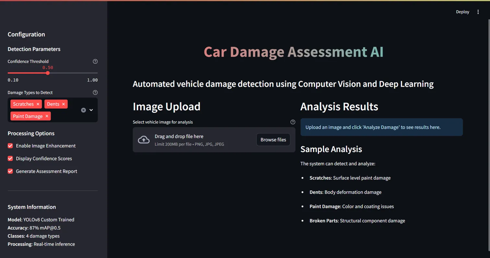
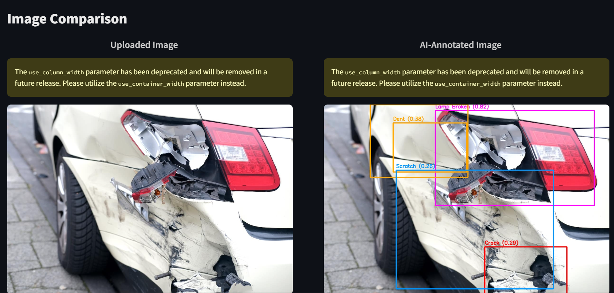
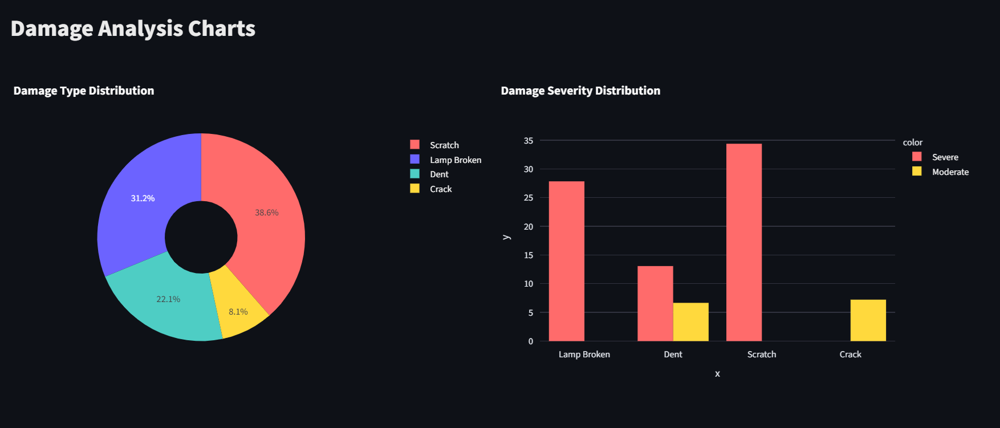

#  Car Damage Detection & Cost Estimation using YOLOv8

##  Project Overview
This project implements an end-to-end **car damage detection system** using **YOLOv8** for object detection.  
It not only detects damaged car parts from images but also:
- Classifies the **type of damage**
- Estimates **damage severity** based on affected area
- Provides an **approximate repair cost**
- Identifies the **location of damage** on the vehicle

This system is designed to assist in **insurance claim automation, vehicle inspection, and damage assessment**.

---

##  Key Features
- Real-time car damage detection using YOLOv8
- Supports **multiple damage types**
- Severity classification: *Light, Moderate, Severe*
- Damage **area-based severity calculation**
- Automatic **repair cost estimation**
- Bounding box visualization with labels
- CPU & GPU (CUDA) support

---

##  Model Details
- **Model:** YOLOv8 (Ultralytics)
- **Framework:** PyTorch
- **Input:** Car images
- **Output:** Bounding boxes + damage metadata
- **Confidence Threshold:** Configurable (default: 0.5)

---

##  Tech Stack
- **Language:** Python  
- **Deep Learning:** PyTorch, YOLOv8 (Ultralytics)  
- **Image Processing:** OpenCV, PIL  
- **Utilities:** NumPy, Logging  

---
## 📸 Sample Output







##  Project Structure

car-damage-detection/
├── models/
│ └── best_model.pt
├── src/
│ └── car_damage_detector.py
├── dataset/
├── notebooks/
├── README.md
└── requirements.txt


##  Supported Damage Types
- Crack  
- Crash  
- Dent  
- Dislocated Part  
- Glass Shatter  
- Lamp Broken  
- No Part  
- Rub  
- Scratch  
- Tire Flat  

---

##  Severity Classification Logic
Severity is determined by the **percentage of image area covered by the detected damage**:

| Severity | Criteria |
|--------|---------|
| Light | Small affected area |
| Moderate | Medium affected area |
| Severe | Large affected area |

Severity thresholds vary based on damage type.

---

##  Cost Estimation
Each detected damage includes an estimated repair cost based on:
- Damage type
- Severity level

>  Cost values are approximate and can be customized for real-world use.

---

##  Installation
```bash
git clone https://github.com/your-username/car-damage-detection.git
cd car-damage-detection
pip install -r requirements.txt

 Usage

python car_damage_detector.py


 Output Example

Each detection returns:

{
  "type": "scratch",
  "severity": "Moderate",
  "confidence": 0.87,
  "area_percentage": 6.3,
  "estimated_cost": 3500,
  "location": "lower right"
}

 Visualization

Detected damages are displayed with:

Bounding boxes

Damage labels

Confidence scores

(Add screenshots here)

 Future Enhancements

Web app deployment using Flask / Streamlit

Video-based damage detection

Insurance claim report generation (PDF)

VIN-based vehicle metadata integration

Cloud deployment (AWS / GCP)


👤 Author

Atharva Patade
🎓 MS in Information Systems (CSULB)
🔗 GitHub: https://github.com/Atharva2223
